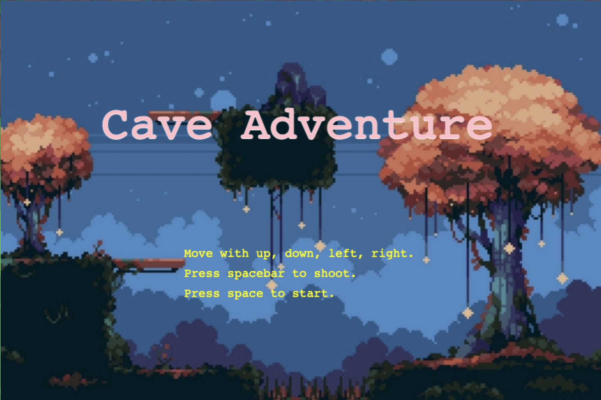
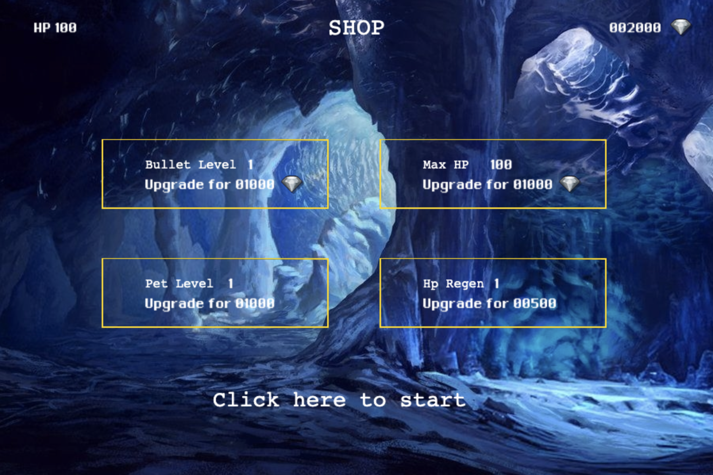
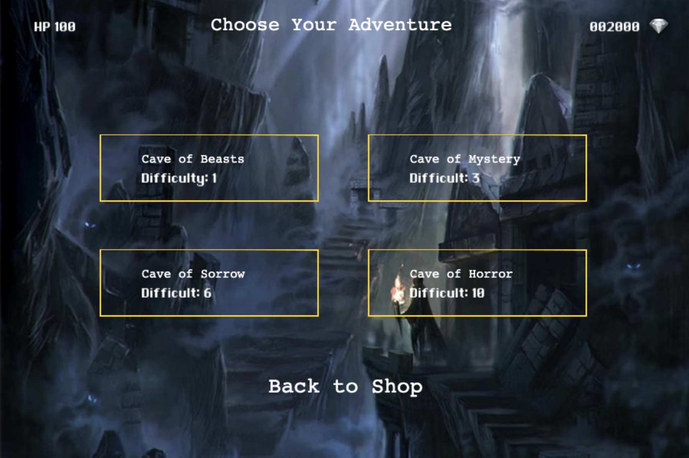
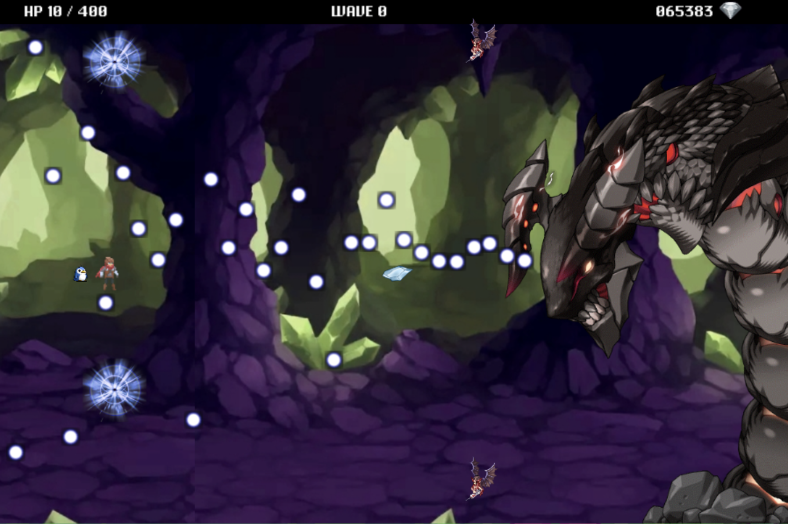

# Cave Adventure

## Background and Overview

Cave Adventure is a 2D fantasy shooter game where the user controls a character (along with a pet) to fight off waves of monsters. Gold is awarded for each monster killed and can be used to buy upgrades such as bullel level, pet level, character hp, or character hp regen. The goal is to fend off waves of monsters as you get stronger in order to beat the final boss.  

## [Live Link](https://caveadventure.netlify.app/)

## Functionality and MVPs

In Cave Adventure, users will be able to:
* Move the character along with the pet using arrow keys
* Take damage by colliding with enemies and enemy missles
* Kill enemies with bullets to collect coins
* Use coins to buy upgrades for bullet, pet, hp, and hp regen
* Choose a cave difficulty and fight the end boss

## Architecture and Technology

* Javascript - v.8.10
* Phaser - v.3.24.1
* CanvasHTML / HTML5

## Resources used

[Itch.io](https://itch.io/game-assets/free) - for game assets.

### Home screen


The game starts by rendering the home screen with an onclick listener set for the spacebar key to start the game while preloading assets.


### Upgrade screen


Players start with 2000 gold to purchase upgrades for their character along with default stats

```
      this.scene.start('shop', {
        gold: 2000,
        hp: 100,
        beamLevel: 1,
        petLevel: 1,
        regenLevel: 1
      });
```

### Level selection


Players are able to select up to 4 different levels with the mobs in each level being generated semi-randomly.

```
if (this.enemies.getChildren().length === 0){
      if (this.currWave < this.maxWaves){
        this.currWave++;
        if (this.level == 4) {
          new Boss(this, 800, 340);
        } 
        else {
          this.waveLabel.text = "Wave " + this.currWave + " / " + this.maxWaves;
          this.numEnemies += this.currWave > 3 ? 3 : 4;
          if (this.currWave == 5) this.numEnemies = 6;
          let currY = 80;
          let currX = 800;
          for (let i = 0; i < this.numEnemies; i++){
              if (currY > 580) {
                currY = currY == 680 ? 115 : 80;
                currX += 100;
              }
              if (this.currWave > 4 ){
                this.generateMonster2(currX, currY);
              } else {
                this.generateMonster1(currX, currY);
              }
              currY += 150;
          }
        }
      } else {
        this.endWave("Dungeon cleared!");
      }
```

### Custom boss


A custom boss on the last stage with custom bullet projectiles

```
class Boss extends Phaser.GameObjects.Sprite {
  constructor(scene, xCoord, yCoord) {
    let x = xCoord;
    let y = yCoord;

    super(scene, x, y, "boss");
    scene.add.existing(this);

    this.setScale(0.75);
    this.play("boss_animation");
    scene.physics.world.enableBody(this);

    scene.enemies.add(this);

    this.timer = 1;
    this.hp = 2000;
    this.damage = -171;
    this.value = 5000;
  }

  update() {
    if (this.x < 0 || this.hp <= 0) {
      this.destroy();
    }
    if (this.timer % 8 === 0){
      new BossMissle(this.scene, 600, 300, "missle1", this.randomInt(0, 160) - 80);
    }
    this.timer++;
  }

  randomInt(min, max){
    return Math.random() * (max - min + 1) + min; 
  }
}
```

### Sample Gameplay


## Bonus Features

* Add a backend to store gameplay progress so it doesn't reset when the page is refreshed
* Add a loading screen when preloading the initial page
* Add more customization and upgrades along with smoother animations
